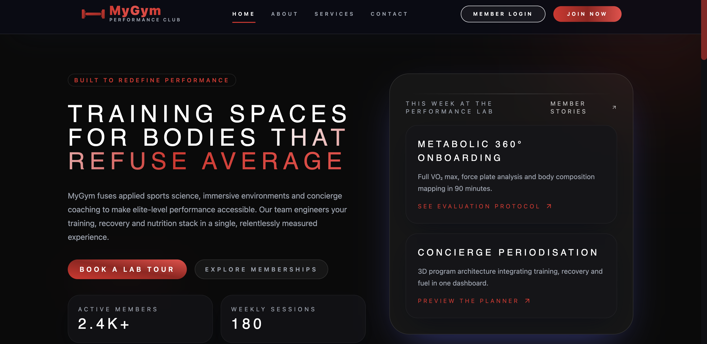

<div align="center">
  
# 🏋️ MyGym – Gym Management System

Professional gym management application with **React frontend** (modern) and **PHP backend** (REST APIs).



</div>

## 🎨 Architecture

### Frontend React (Modern - Recommended)
- **Framework**: React 18 + TypeScript
- **Build**: Vite 5.4
- **Styling**: TailwindCSS with red/black theme
- **State**: Zustand (authentication, navigation)
- **Router**: React Router v6
- **Animations**: Framer Motion

### Backend PHP
- **REST APIs**: JSON format with CORS
- **Auth**: PHP Sessions + bcrypt hashing
- **Database**: MySQL via XAMPP/PDO
- **Security**: CSRF protection, input validation

---

## 🚀 Quick Start

### Development Mode (⭐ Recommended)

**1. Start XAMPP**
```bash
# Launch Apache and MySQL from XAMPP Control Panel
```

**2. Start React**
```bash
cd /Applications/XAMPP/xamppfiles/htdocs/MyGym/frontend
npm install    # First time only
npm run dev    # Starts on http://localhost:5173
```

**3. Access the application**
- React Frontend: `http://localhost:5173`
- Backend APIs: `http://localhost/MyGym/backend/api/`

### Production Mode

```bash
# Build React
cd frontend && npm run build

# Access via XAMPP
# http://localhost/MyGym/frontend/
```

---

## 📡 API Endpoints

### Authentication
| Endpoint | Method | Description |
|----------|---------|-------------|
| `/backend/api/auth/login.php` | POST | Login with identifier + password |
| `/backend/api/auth/register.php` | POST | Registration (fullName, email, password) |
| `/backend/api/auth/logout.php` | POST | Logout |
| `/backend/api/auth/me.php` | GET | Get current user |

### Contact
| Endpoint | Method | Description |
|----------|---------|-------------|
| `/backend/api/contact.php` | POST | Submit contact form |

---

## 🔗 React + PHP Integration

### How does it work?

**In development:**
- React (port 5173) → Vite proxy → PHP Backend (port 80)
- Proxy configuration in `frontend/vite.config.ts`
- Environment variables in `frontend/.env`

**In production:**
- React build in `frontend/dist/`
- `frontend/index.php` serves the build via Apache
- APIs accessible directly

### Configuration

**frontend/.env**
```env
VITE_API_BASE_URL=http://localhost/MyGym/backend/api
```

**frontend/vite.config.ts**
```typescript
server: {
  proxy: {
    '/MyGym/backend': {
      target: 'http://localhost',
      changeOrigin: true
    }
  }
}
```

---

## 🎨 Red/Black Theme

### Main Colors
```css
--color-primary: #dc2626      /* Red */
--color-secondary: #7f1d1d    /* Dark Red */
--color-bg: #0a0a0a           /* Black */
--color-bg-muted: #1a1a1a     /* Medium Black */
```

### Location
- React: `frontend/src/styles/global.css`
- PHP: Inline CSS in `index.php`, `login.php`, `register.php`

---

## 🚀 Features

### ✅ Implemented
- 🔑 **Complete Authentication**
  - Login/Register React + PHP
  - Secure PHP Sessions
  - Automatic verification (whoami)
  - 3 roles: ADMIN, COACH, MEMBER

- 🎨 **Modern Interface**
  - Professional red/black design
  - Smooth animations (Framer Motion)
  - Mobile-first responsive
  - Glassmorphism effects

- 🏠 **Main Pages**
  - Home with hero, features, pricing, testimonials
  - Login/Register with validation
  - About, Services, Contact

- 📊 **Complete Dashboards** ⭐ NEW!
  - ADMIN Dashboard (KPIs, activity, stats)
  - COACH Dashboard (sessions, members, actions)
  - MEMBER Dashboard (upcoming sessions, progress, recovery)
  - Role-based sidebar navigation
  - Navbar automatically hidden on dashboard

- 🔌 **REST APIs**
  - Complete Auth (login, register, logout, me)
  - Contact form
  - CORS configured

### 📋 Next Steps
- 💳 Subscription management pages (CRUD)
- 📅 Course management pages (CRUD)
- 👤 User profile pages (edit)
- 👥 User management pages (ADMIN)

---

## 📁 Project Structure

```
MyGym/
├── frontend/                 # React App
│   ├── src/
│   │   ├── components/      # Reusable components
│   │   ├── pages/           # Pages (Home, Login, Dashboard)
│   │   ├── lib/
│   │   │   ├── api/         # API clients
│   │   │   ├── store/       # Zustand stores
│   │   │   └── types/       # TypeScript types
│   │   └── styles/          # global.css (theme)
│   ├── dist/                # Production build
│   ├── index.php            # XAMPP entry point
│   ├── .htaccess            # Apache routing
│   ├── vite.config.ts       # Vite config
│   └── package.json
│
├── backend/
│   ├── api/                 # REST APIs
│   │   ├── auth/            # Authentication
│   │   ├── bootstrap.php    # Init (CORS, JSON)
│   │   ├── helpers.php      # Utils
│   │   └── contact.php
│   ├── auth.php             # Session management
│   ├── db.php               # MySQL connection
│   └── *.php                # Classic endpoints
│
├── admin/                   # Admin Dashboard PHP
├── coach/                   # Coach Dashboard PHP
├── member/                  # Member Dashboard PHP
│
├── doc/                     # 📦 Archived files
│   ├── old_styles/          # Old themes and styles
│   ├── test_files/          # Test and diagnostic files
│   ├── backups/             # File backups
│   └── doc.png              # Documentation image
│
├── .htaccess                # Apache redirects
├── README.md                # This file
└── QUICKSTART.md            # Quick guide
```

### 📦 doc/ Folder
The `doc/` folder contains archived files not used in the current version:
- **old_styles/** - Old themes and designs (legacy styles, red theme, special designs)
- **test_files/** - Test and diagnostic files (colors_summary, diagnose, test_*.php)
- **backups/** - File backups (index_backup.php)
- **doc.png** - Project documentation image

---

## 🛠️ Useful Commands

### Development
```bash
cd frontend
npm install          # Install dependencies
npm run dev          # Dev server (http://localhost:5173)
npm run lint         # Linter
npm run test         # Tests
```

### Production
```bash
npm run build        # Build for production
npm run preview      # Preview the build
```

---

## 🐛 Troubleshooting

### Port 5173 busy
```bash
# Vite will automatically choose 5174
# Or free the port:
lsof -ti:5173 | xargs kill -9
```

### "Build Required" Error
```bash
cd frontend && npm run build
ls -la frontend/dist/  # Check that the build exists
```

### APIs return 404
- ✓ XAMPP Apache started
- ✓ Correct path: `http://localhost/MyGym/backend/api/...`
- ✓ mod_rewrite enabled in Apache

### CORS errors
- CORS headers in `backend/api/bootstrap.php`
- Allowed origins: localhost:5173, localhost:5174

---

## 📚 Technologies

**Frontend**
- React 18.2, TypeScript 5.6
- Vite 5.4, TailwindCSS 3.4
- Framer Motion, React Router 6
- Zustand, React Hook Form, Zod

**Backend**
- PHP 7.4+, MySQL
- PDO, Native Sessions
- Password hashing (bcrypt)

**DevOps**
- XAMPP (Apache + MySQL)
- npm, ESLint, Prettier, Vitest

---

## 🎯 Next Steps

1. **Migrate dashboards to React**
   - Create React Dashboard pages
   - APIs for users, courses, subscriptions
   - Tables and forms

2. **Security**
   - Rate limiting
   - Refresh tokens
   - CSRF for all APIs

3. **Performance**
   - Cache API queries
   - Image optimization
   - Lazy loading routes

---

## 📝 Important URLs

- **React Application** ⭐: http://localhost:5173 (development)
- **React Dashboard**: http://localhost:5173/dashboard (after login)
- **Production**: http://localhost/MyGym/ (after build)
- **Backend APIs**: http://localhost/MyGym/backend/api/
- **PHP Admin Dashboard**: http://localhost/MyGym/admin/ (legacy, to be replaced)

---

